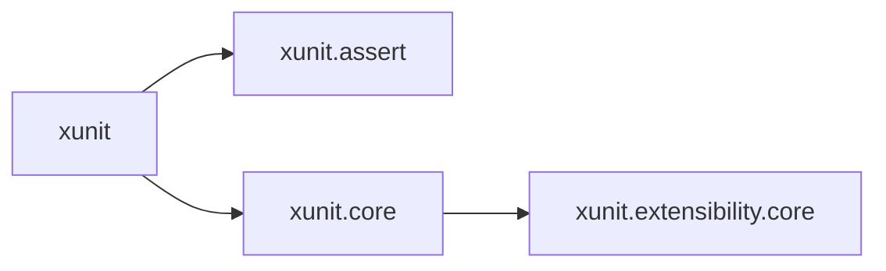

# Transitive nuget dependencies

This example defines a simple CLI and an associated unit test project (using xunit). Note that the
unit tests do not run due to the lack of a shim.

The Xunit framework is split across a number of nuget packages. Key dependencies for this examples
are shown here:

Adding a dependency on xunit is sufficient to build an xunit test binary with MSBuild (even using
Paket), however this is not the case when building with Bazel and rules_dotnet.

The `//src:tests` target in this repository contains two commented out nuget references. Without
these, the project cannot build.

For more complex projects, the discovery of which additional packages must be referenced can become
a time consuming task.
